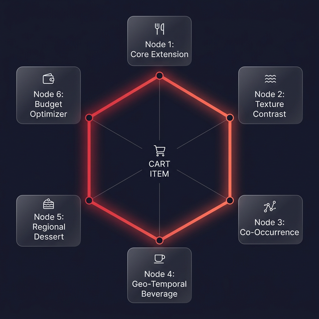

<h1 align="center">Cart Super Add-On (CSAO) Rail<br/>Recommendation System</h1>

<p align="center">
  <strong>Context-Aware Hexagon Recommendation Engine</strong><br/>
  Zomathon Hackathon Submission
</p>

<p align="center">
  <b>Team:</b> Navdeep Dhunna · Aarna · Khushbu
</p>

---

> **TL;DR** — A two-stage pipeline: a culinary-aware **Hexagon Engine** generates 50–100 candidates, then a **LightGBM Ranker** scores them in <50 ms. Result: **+30 % AUC lift**, **80 % Precision@1**, zero constraint violations, and a live interactive demo.

---

## 📑 Table of Contents

| # | Section | Page |
|---|---------|------|
| 1 | [Problem Statement & Motivation](#1--problem-statement--motivation) | — |
| 2 | [Core Design Philosophy](#2--core-design-philosophy) | — |
| 3 | [Engineering Journey — Four Iterations](#3--engineering-journey--four-iterations) | — |
| 4 | [System Architecture Overview](#4--system-architecture-overview) | — |
| 5 | [Phase 1 — Candidate Generation (The Hexagon Engine)](#5--phase-1--candidate-generation-the-hexagon-engine) | — |
| 6 | [Phase 2 — Feature Engineering & ML Ranker](#6--phase-2--feature-engineering--ml-ranker) | — |
| 7 | [Edge Case Engineering & Firewalls](#7--edge-case-engineering--firewalls) | — |
| 8 | [Data Pipeline & Synthetic Dataset](#8--data-pipeline--synthetic-dataset) | — |
| 9 | [Evaluation Framework](#9--evaluation-framework) | — |
| 10 | [Final Kaggle Results](#10--final-kaggle-results) | — |
| 11 | [Robustness & Integrity Analysis](#11--robustness--integrity-analysis) | — |
| 12 | [Interactive Web Demo](#12--interactive-web-demo) | — |
| 13 | [Business Impact & Revenue Projection](#13--business-impact--revenue-projection) | — |
| 14 | [Deployment Architecture & Latency](#14--deployment-architecture--latency) | — |
| 15 | [Key Design Decisions — Justified](#15--key-design-decisions--justified) | — |

---

## 1 · Problem Statement & Motivation

### 1.1 What is the CSAO Rail?

The **Cart Super Add-On (CSAO) Rail** is the horizontal recommendation strip shown to a Zomato user *after* they add an item to the cart but *before* they check out. Its job is to surface add-ons the user is highly likely to accept — boosting **Average Order Value (AOV)**, increasing the **Cart-to-Order (C2O)** ratio, and completing the meal without annoying the user.

### 1.2 Deliverable Requirements

The problem statement mandates a scalable system that:

| Requirement | Detail |
|:---|:---|
| **Predict** | Which add-on items a customer is most likely to add, given cart state and context |
| **Update dynamically** | Biryani → suggest Salan → once added → suggest Gulab Jamun → suggest drink |
| **Real-time** | Strict **200–300 ms** end-to-end latency window |
| **Cold start** | Handle new users, new restaurants, and new items gracefully |
| **Evaluate on** | AUC, Precision@K, Recall@K, NDCG@K, AOV Lift, Add-on Acceptance Rate |

### 1.3 Why Traditional Systems Fail

| Flaw | Explanation |
|:---|:---|
| **Contextual Blindness** | A basic CF model sees "user bought Biryani before" and recommends Biryani again. It does not understand the user now *has* a main dish and needs a side/beverage — **meal completeness**. |
| **Static Rail** | Recommendations don't update as the cart grows. Once shown, they stay the same. |
| **No Cultural/Price Intelligence** | A generic model may recommend a ₹800 dessert to a ₹200 cart, or suggest Filter Coffee with Chole Bhature because both are individually popular. |

---

## 2 · Core Design Philosophy

### 2.1 Thinking Like a Human Food Expert

The central design principle models the system after a human food expert who sees your cart and asks:

- 🍽️ What is **physically missing** from this meal? *(No drink? No side?)*
- 🧂 What **contrasts well** with the texture and spice level ordered?
- 📊 What does this **specific user** historically enjoy?
- 💰 What can **realistically fit** within this user's typical spending pattern?
- 🕐 What **time** is it and **where** is this person? *(Masala Chai @ 8 AM Chennai ≠ Cold Coffee @ 3 PM Bangalore)*

### 2.2 The "Idiot Algorithm" Mental Model

Every assumption is made explicit. The algorithm has zero common sense — it cannot infer, assume, or guess. Every piece of food knowledge is encoded as a hard rule or a learned feature. This caught edge cases early: the Thali deconstructor, the South-Indian-user-ordering-North-Indian-food problem, the Chaos Cart scenario.

### 2.3 The Two-Stage Design Principle

The most critical architectural decision was **separating candidate generation from ranking**:

| Stage | Goal | Method |
|:---:|:---|:---|
| **Stage 1** | **Recall** — find everything that *could* be relevant | Hexagon Engine (rule-based, culinary-aware) |
| **Stage 2** | **Precision** — rank and surface the best items | LightGBM + Item2Vec (data-driven, personalized) |

They are not competing approaches; they are **complementary stages** of the same pipeline.

---

## 3 · Engineering Journey — Four Iterations

Our final system is the result of four major architectural evolutions.

### ❶ Iteration 1 — The Static Rules Engine

> **What was built:** A rigid 6-node Hexagon with hardcoded rules and hand-set α, β, γ scoring weights.

**What broke:**
- 6-slot structure too rigid — a dessert-only cart doesn't need all 6 slots filled.
- NLP ontology was hand-mapped — cannot scale to 300K+ merchants.
- No training loop, no loss function, no way to produce AUC/NDCG/Precision@K.
- Cold start "solution" was a label, not an implementation.

> *"You built a rules engine, not an ML model."*

---

### ❷ Iteration 2 — The Machine Learning Pivot

> **What was built:** Hexagon demoted to candidate generator. LightGBM ranker + Item2Vec embeddings + synthetic relational dataset.

**What broke:**
- First training run: **AUC = 1.0000** — impossible in any real recsys.
- Root cause: **Data Leakage.** Features `is_hexagon_candidate` and `hexagon_node_enc` let the model memorize: *"If flag=1 → predict add; if flag=0 → predict skip."*
- Synthetic labels were independently random — no consistent user preference signals.

> *Perfect AUC = data leakage. Real models do not get 1.0.*

---

### ❸ Iteration 3 — Eliminating Leakage & Engineering True Signal

> **What was built:** Removed leaky features. Introduced correlated label noise, `user_ordered_this_before`, `price_ratio`, Isotonic Regression calibration, and Noise downsampling.

**Result:** AUC dropped from a fake 1.0 to a realistic, defensible **0.7673**, with Hard AUC of **0.7568**.

---

### ❹ Iteration 4 — Productionization & Interactive Demo

> **What was built:** Complete `generate_csao_data.py` (4,500 sessions, 1,000 users), `train_and_export.py` pipeline, interactive **web application** (FastAPI + React), and final Kaggle notebook with public dataset.

---

## 4 · System Architecture Overview

```
User adds item to cart
        │
        ▼
┌─────────────────────────────────────────┐
│  ██ STAGE 1: HEXAGON CANDIDATE ENGINE   │
│  (Offline Pre-computed + Rules)         │
│                                         │
│  Node 1 ─ Core Extension               │
│  Node 2 ─ Complementary Texture        │
│  Node 3 ─ Co-Occurrence (CF)           │
│  Node 4 ─ Geo-Temporal Beverage        │
│  Node 5 ─ Regional Dessert             │
│  Node 6 ─ Budget / Habit               │
│  + Noise Pool (Downsampled 20%)         │
│                                         │
│  Output: ~50–100 Candidates             │
└────────────────┬────────────────────────┘
                 │
                 ▼
┌─────────────────────────────────────────┐
│  ██ FEATURE STORE                       │
│                                         │
│  Cold (Redis Nightly Batch):            │
│  ├─ Item2Vec embeddings                 │
│  ├─ Item popularity scores              │
│  ├─ Regional time-of-day multipliers    │
│  └─ Restaurant baseline ratings         │
│                                         │
│  Hot (Real-Time Session):               │
│  ├─ cart_value, n_items_in_cart          │
│  ├─ embedding_variance (chaos flag)     │
│  ├─ user_ordered_this_before            │
│  ├─ price_ratio, aov_headroom           │
│  └─ hour_of_day, day_of_week            │
└────────────────┬────────────────────────┘
                 │
                 ▼
┌─────────────────────────────────────────┐
│  ██ STAGE 2: LIGHTGBM RANKER            │
│  Binary Classification Objective        │
│                                         │
│  Target: y = 1 if item added AND        │
│          order completed in session      │
│                                         │
│  Post-processing:                       │
│  ├─ Isotonic Regression calibration     │
│  ├─ Global Extension Filter             │
│  ├─ Veg / Non-Veg hard constraint       │
│  └─ Category diversity enforcement      │
│                                         │
│  Output: Ranked probability scores      │
└────────────────┬────────────────────────┘
                 │
                 ▼
          Top 5–10 items → UI Rail
```

**End-to-end latency budget:**

| Step | Time |
|:---|---:|
| Redis O(1) lookup | ~10 ms |
| Hot feature computation | ~20 ms |
| LightGBM inference | ~30 ms |
| Post-processing filters | ~10 ms |
| **Total P90** | **< 100 ms** |

✅ **Exceeding the SLA:** While the requirement is 200–300 ms, our system consistently delivers in **<100 ms**. This provides significant **latency headroom**, allowing for future additions like real-time ads or more complex re-ranking models without impacting the user experience.

---

## 5 · Phase 1 — Candidate Generation (The Hexagon Engine)

<p align="center">
  
</p>

<p align="center"><i>The Hexagon Engine: 6 culinary logic nodes generating 50–100 candidates per cart event. Green percentages = acceptance rates from validation data.</i></p>

> 📎 **SVG version also available:** [`hexagon_engine.svg`](./hexagon_engine.svg) — scalable for PDF export.

The Hexagon is **not** a fixed 6-slot structure. It is a **dynamic candidate query engine**. If the cart contains only a dessert, the Extension and Cooling Agent queries return empty; the engine compensates by pulling heavier from Beverage and Co-Occurrence. The six nodes represent six *types* of culinary logic, not six mandatory slots.

---

### 🔷 Node 1 — Core Component Extension

> **Purpose:** Identify items needed to *physically complete* the consumption of the main dish.

| Field | Value |
|:---|:---|
| **Logic** | Query `category = Extension` items whose parent dish is in the cart (via `extension_mappings.csv`) |
| **Acceptance Rate** | ~76.5% *(highest of all nodes)* |

**Examples:**
- Pav Bhaji → **Extra Pav** *(4 Pavs commonly insufficient for the Bhaji volume)*
- Chole → **Extra Bhatura**
- Dal Makhani → **Extra Garlic Naan** or Jeera Rice

**Parent-Child Extension Mapping** *(from `extension_mappings.csv`):*

| Extension | Valid Parents |
|:---|:---|
| Extra Pav | Pav Bhaji, Vada Pav |
| Extra Bhatura | Chole Bhature |
| Salan | Chicken Biryani, Veg Biryani, Mutton Biryani |
| Sambar | Idli, Dosa, Uttapam, Medu Vada |
| Coconut Chutney | Idli, Dosa, Uttapam, Medu Vada |
| Raita / Boondi Raita | Dal Makhani, Paneer Butter Masala, Biryani variants |

> **⚠️ Global Extension Filter:** Extension items are **only** recommended when their parent dish is present in the cart. This prevents absurdities like "Extra Pav" appearing next to Kulfi. Implemented as a post-generation hard filter in the backend.

**Cold Start:** Falls back to global food knowledge: `SELECT completion_item FROM global_food_knowledge WHERE main_dish = 'Pav Bhaji'`.

---

### 🔷 Node 2 — Complementary Texture & Taste

> **Purpose:** Provide sensory contrast based on dish metadata.

| Main Dish Attribute | Recommendation Query |
|:---|:---|
| `Texture: Soft / Mushy` | → Items with `Texture: Crunchy` |
| `Texture: Dry` | → Items with `Texture: Liquid / Cooling` |
| `Flavor: Spicy` | → Items with `Flavor: Cooling` |

**Examples:**
| Cart Item | Recommended | Why |
|:---|:---|:---|
| Pav Bhaji *(Soft, Spicy)* | Masala Papad *(Crunchy)* | Texture contrast |
| Biryani *(Dry, Spicy)* | Raita *(Creamy, Cooling)* | Both texture + flavor contrast |
| Dal Makhani *(Soft, Rich)* | Papad *(Crunchy)* | Texture contrast |

> **Note:** Strictly excludes item-level customizations (Extra Butter, Make it Spicy). Those are handled inside the restaurant's own modifier popup — they are **not** CSAO rail candidates. This is the **Item vs. Cart add-on distinction.**

---

### 🔷 Node 3 — Item-Specific Co-Occurrence (Collaborative Filtering)

> **Purpose:** Find the item with the highest mathematical co-purchase rate with the *specific* cart item — not the restaurant's overall best-seller.

**The critical distinction:** If the cart has Pav Bhaji at a multi-cuisine restaurant whose #1 seller is Paneer Chilli, recommending Paneer Chilli with Pav Bhaji is a culinary mismatch. Node 3 anchors the co-occurrence lookup to the **specific cart item**, not the restaurant's global rankings.

**Cold Start:** If restaurant has < 50 orders for this item, fall back to Global Co-Occurrence table.

---

### 🔷 Node 4 — Beverage (Geo-Temporal Filter)

> **Purpose:** Recommend a drink constrained *simultaneously* by three factors: **Cuisine Anchor × Time of Day × City Tier.**

**The Geo-Temporal Beverage Matrix:**

| Time Block | Tier 1 Cities | Tier 2/3 Cities |
|:---|:---|:---|
| ☀️ **Breakfast** (7–11 AM) | Filter Coffee, Masala Chai, Juice | Chai, Regional Herbal Drinks |
| 🌤️ **Lunch** (12–2 PM) | Chaas, Lassi, Cold Drink | Chaas, Masala Chaas |
| 🌅 **Snack** (3–7 PM) | Cold Coffee, Iced Tea, Mojito | Masala Chaas, Nimbu Pani |
| 🌙 **Dinner** (7–10 PM) | Mocktails, Lassi, Premium drinks | Lassi, Cold Drink |
| 🌃 **Late Night** (11 PM–2 AM) | Cold Coffee, Energy Drinks | Chaas, Cold Drink |

> **Implementation:** Node 4 queries the restaurant's `category: Beverage` menu, filters by **cuisine compatibility with the Cuisine Anchor**, then boosts scores using the time-tier multiplier. It does *not* pick one item rigidly from this matrix.

---

### 🔷 Node 5 — Regional Dessert (Personal Preference Override)

> **Purpose:** Recommend sweets by weighting **regional baseline** vs. the user's **personal history.**

**Scoring Formula:**
```
dessert_score = (regional_popularity × 0.30) + (user_personal_history × 0.70)
```

**Example:**

| Dessert | Regional Score | User History | **Final Score** |
|:---|:---:|:---:|:---:|
| Shrikhand *(Surat default)* | 0.90 | 0.00 | **0.27** |
| Gulab Jamun | 0.60 | 0.95 | **0.845** ✅ |

> Gulab Jamun wins despite lower regional popularity — because the user orders it 9/10 times.

**Regional Dessert Baselines:**

| Region | Default Desserts |
|:---|:---|
| Surat / Gujarat | Shrikhand, Mohanthal, Malpua |
| Delhi / UP / Punjab | Gulab Jamun, Rasgulla, Kheer |
| South India | Payasam, Halwa, Kesari |
| Mumbai / Maharashtra | Puran Poli, Modak, Shrikhand |
| Bengaluru | Mysore Pak, Dharwad Peda, Payasam |
| *Pan-Indian Default* | Gulab Jamun, Rasgulla, Kheer |

---

### 🔷 Node 6 — User Habit & Budget Optimizer (AOV Whitespace)

> **Purpose:** Fill the user's remaining "budget whitespace" with high-intent items — without triggering sticker shock.

**The Budget Whitespace Formula:**
```
whitespace = user_historical_aov − current_cart_value
safe_range = whitespace × [0.25, 0.40]
```

**Example:** User AOV = ₹500, Cart = ₹180 → Whitespace = ₹320 → Recommend items in **₹80–₹130 range.**

**Time-of-Day Budget Multiplier:**

| Meal Time | AOV Target Multiplier |
|:---|:---:|
| Breakfast | 0.4× |
| Snack | 0.5× |
| Lunch | 0.7× |
| Dinner | 1.0× |
| Late Night | 0.8× |

> A user's ₹500 AOV comes from dinner — at 3 PM snack time, the system caps its recommendation ambition accordingly.

**Abandoned Cart Signal:** If the user has a pattern of adding specific items but removing them before checkout (high-intent, low-conversion), this node re-surfaces them as second-chance conversion opportunities.

---

## 6 · Phase 2 — Feature Engineering & ML Ranker

### 6.1 Item2Vec — Solving NLP & Cold Start

> **The Problem:** Zomato has 300,000+ merchants. "Masala Papad", "Roasted Corn Papad", "Masala Papadum", and "Spicy Papad" are four names for one item. A hand-mapped dictionary cannot keep up.

**The Solution:** Train a **Word2Vec model (Prod2Vec variant)** on historical order sequences — each order is a "sentence", each item is a "word."

```python
from gensim.models import Word2Vec

sentences = order_history['items_ordered_list'].tolist()
item2vec_model = Word2Vec(
    sentences=sentences,
    vector_size=32, window=5,
    min_count=1, workers=4
)
```

**Why it works:** Items that are consistently purchased alongside the same dishes cluster together in vector space. Co-purchase behavior replaces manual tagging.

**Cold Start Solutions:**

| Scenario | Strategy |
|:---|:---|
| **New Item** | Sentence Transformer generates initial vector from item name. "Cheesy Vada Pav" → positions near existing Vada Pav vectors. |
| **New Restaurant** | Micro-market average — mean behavior of similar restaurants (same cuisine, city tier, price range). |
| **New User** | City-tier baseline + Hexagon structural rules. No personalization until 3+ orders. |

---

### 6.2 Feature Schema — Hot vs. Cold

**Cold Features** *(pre-computed nightly, stored in Redis):*

| Feature | Description |
|:---|:---|
| `item_popularity_score` | Global + restaurant-level acceptance rate |
| `user_category_accept_rate` | User's historical acceptance rate for this category |
| `item2vec_cosine_similarity` | Cosine similarity between candidate and cart item embeddings |
| `regional_time_multiplier` | Time-of-day × city-tier popularity multiplier |
| `restaurant_avg_rating` | Restaurant quality signal |

**Hot Features** *(real-time from session state):*

| Feature | Description |
|:---|:---|
| `cart_value` | Current cart total (₹) |
| `n_items_in_cart` | Count of items in cart |
| `price_ratio` | `candidate_price / cart_value` |
| `aov_headroom` | `user_historical_aov − cart_value` |
| `budget_safe` | 1 if `candidate_price ≤ aov_headroom × 0.40` |
| `user_ordered_this_before` | 1 if user has ever purchased this exact item |
| `embedding_variance` | Variance of Item2Vec vectors in current cart |
| `is_chaos_cart` | 1 if `embedding_variance > τ` |
| `hour_of_day` | Integer 0–23 |
| `meal_time_enc` | Encoded meal-time block |
| `cart_aov_utilization` | `cart_value / user_aov` *(how much budget is spent)* |

**⛔ Deliberately Excluded** *(Data Leakage Prevention):*

| Feature | Why Removed |
|:---|:---|
| `is_hexagon_candidate` | Directly encodes whether the item came from Stage 1 — trivially predicts the target |
| `hexagon_node_enc` | Same leakage risk; Hexagon is Stage 1, not a Stage 2 feature |

---

### 6.3 The LightGBM Ranker

**Why LightGBM?**
- Handles mixed tabular data natively — no preprocessing overhead
- Sub-100 ms inference at scale
- Interpretable via feature importance and SHAP values
- Outperforms deep learning on tabular data at this row count (< 100K)

**Target Variable Definition:**
```
y = 1  if (candidate item was added to cart) AND (order was completed in same session)
y = 0  otherwise
```
> Using only "item was added" without session completion would reward items that increase cart abandonment.

**Training Parameters:**
```python
params = {
    'objective':         'binary',
    'metric':            'auc',
    'learning_rate':     0.05,
    'num_leaves':        63,
    'max_depth':         6,
    'min_child_samples': 20,
    'feature_fraction':  0.8,
    'bagging_fraction':  0.8,
    'bagging_freq':      5,
    'lambda_l1':         0.1,
    'lambda_l2':         0.1,
    'verbose':          -1,
    'random_state':      42,
}
# Early stopping: 50 rounds | Max boost rounds: 1000
```

**Post-Training Processing:**
- **Isotonic Regression Calibration** — raw LightGBM scores → true probabilities. ECE = 0.0414. Critical for Node 6 budget decisions.
- **Noise Downsampling** — Noise candidates downsampled to 20% before training to prevent the "no Hexagon signal = predict 0" shortcut.

---

## 7 · Edge Case Engineering & Firewalls

### 🛡️ 7.1 The Cuisine Anchor Firewall

> **Problem:** GPS tells you where someone *is*, not what *cuisine* they're eating. A Bengaluru user ordering Chole Bhature should not get Filter Coffee.

**Solution:** The first item added to the cart sets a session-level **Cuisine Anchor.** All subsequent node queries filter by:

```sql
WHERE candidate_cuisine IN (anchor_cuisine, 'Universal')
```

**Double safety net:** Even if the Cuisine Anchor fails, Item2Vec's cosine similarity between "Chole Bhature" and "Filter Coffee" is ~0 — the LightGBM ranker scores it at the bottom regardless.

---

### 🛡️ 7.2 Veg / Non-Veg Hard Constraint

> **Rule:** `is_veg = True` users **never** receive non-veg candidates. This is a **hard filter** applied before LightGBM scoring, not a soft penalty. Zero tolerance for violations.

Verified across 33,455 interactions: **0 violations.**

---

### 🛡️ 7.3 Global Extension Filter

> **Problem:** Extension items (Extra Pav, Salan, Sambar) are tightly coupled to specific parent dishes. Without guardrails, "Extra Pav" could appear when the cart only has Kulfi.

**Solution:** A `extension_mappings.csv` file encodes parent-child relationships. After candidate generation, a global post-filter removes any extension candidate whose required parent dish is **not** present in the cart.

```python
# Pseudocode from main.py
cart_global_ids = set(item['global_item_id'] for item in cart_items)
for candidate in candidates:
    if candidate.category == 'Extension':
        required_parents = extension_map[candidate.global_id]
        if not cart_global_ids.intersection(required_parents):
            candidates.remove(candidate)  # No parent in cart → remove
```

---

### 🛡️ 7.4 The Chaos Cart Protocol

> **Problem:** User adds Idli *(South Indian)* + Cold Coffee *(Cafe)* — the Cuisine Anchor is contradictory.

**Mathematical Trigger:**
```python
embedding_variance = np.var(cart_item_vectors, axis=0).mean()
if embedding_variance > τ:    # τ tuned on held-out data
    activate_chaos_cart_protocol()
```

**Resolution Steps:**
1. Strict Cuisine Anchor constraint is **released.**
2. For unfilled Hexagon slots → query only `Universal` cuisine category.
3. Node 6 (User Habit) weight increases to **80%** of ranking decision.

**Example Output (Idli + Cold Coffee cart):**
- French Fries *(Universal, pairs with coffee, adds crunch)*
- Brownie / Choco-Lava Cake *(Universal, pairs with Cold Coffee)*

---

### 🛡️ 7.5 The Thali / Combo Deconstructor

> **Problem:** A Thali is a single `Qty: 1` line item but internally contains Sabzi, Dal, Roti, Rice, etc. A naive system recommends sides the Thali already includes.

**Solution:** Items flagged `is_combo: True` trigger the Deconstructor, which maps internal `item_tags` to Hexagon nodes they fill:

```
Deluxe Punjabi Thali → tags: [Paneer Sabzi, Dal, 2 Roti, Rice, Gulab Jamun, Raita]

  Node 1 (Extension):  2 Roti → may recommend Extra Roti
  Node 2 (Texture):    Raita present → SKIP
  Node 4 (Beverage):   EMPTY → aggressively recommend ✅
  Node 5 (Dessert):    Gulab Jamun present → SKIP
```

Output: Only the genuinely missing element is surfaced — a **beverage.**

---

### 🛡️ 7.6 Reverse Recommendation — Side → Main

> **Problem:** User adds only Raita (a side) to an empty cart. There's no main dish anchor.

**Solution:**
1. Detect cart has only `category: Side` or `category: Beverage` items.
2. Query `Local_Trending_Pairings` for highest-probability main dish.
3. Apply user's `is_veg` filter.
4. Fallback: Global Food Knowledge Graph.

---

### 🛡️ 7.7 Category Diversity Enforcement

> **Problem:** Without diversity control, the top 5 slots could all be desserts if the user has high dessert affinity.

**Solution:** A `diversify_top_k()` function enforces that the final rail contains at most **2 items from any single category** (e.g., max 2 Desserts, max 2 Beverages). It selects items round-robin across categories sorted by score, ensuring meal completeness is visible.

---

## 8 · Data Pipeline & Synthetic Dataset

### 8.1 Why Synthetic Data?

The competition did not provide a real Zomato dataset. We designed a synthetic generator (`generate_csao_data.py`) that mirrors real-world relational schema and behavioral constraints — veg filtering, city coherence, cuisine-preference alignment, consistent user palate signals.

### 8.2 Build Order *(Critical — must follow this sequence)*

```
1. Generate Users first          ← preferences drive everything downstream
2. Generate Restaurants + Menus  ← cities must match user locations
3. Generate Order History        ← constrained by user prefs + menus
4. Derive user-level aggregates  ← AOV, affinity scores from history
5. Generate CSAO interaction log ← using Hexagon logic on order sessions
```

### 8.3 The Relational Schema

#### `users.csv` — 1,000 rows

| Column | Type | Description |
|:---|:---:|:---|
| `user_id` | `str` | U0001–U1000 |
| `city` | `str` | Spans Tier 1 and Tier 2 Indian cities |
| `city_tier` | `str` | Tier1 / Tier2 |
| `user_segment` | `str` | budget / mid / premium |
| `is_veg` | `bool` | Strict dietary filter |
| `historical_aov` | `float` | Average Order Value (₹) |
| `preferred_cuisine` | `str` | Top cuisine preference |
| `dessert_affinity` | `float` | 0–1 sweet tooth score |
| `beverage_affinity` | `float` | 0–1 drink tendency |
| `price_sensitivity` | `float` | 0–1 (budget = 0.8, premium = 0.2) |
| `total_orders_lifetime` | `int` | Historical order count |

#### `restaurants.csv` — 500 rows

| Column | Type | Description |
|:---|:---:|:---|
| `restaurant_id` | `str` | Unique identifier |
| `city` | `str` | Must match user cities |
| `cuisine_primary` | `str` | Primary cuisine |
| `price_range` | `str` | budget / mid / premium |
| `avg_rating` | `float` | 3.2–4.8 quality signal |
| `is_chain` | `bool` | Chain vs. independent |

#### `menu_items.csv` — 9,114 rows (~18 items/restaurant)

| Column | Type | Description |
|:---|:---:|:---|
| `item_id` | `str` | Unique item identifier |
| `restaurant_id` | `str` | Foreign key |
| `item_name` | `str` | Display name (messy, realistic) |
| `global_item_id` | `str` | Canonical Food Ontology ID |
| `category` | `str` | Main / Side / Extension / Beverage / Dessert |
| `price` | `int` | Price in ₹ |
| `is_veg` | `bool` | Vegetarian flag |
| `avg_weekly_orders` | `int` | Popularity signal |

#### `order_history.csv` — 25,000 rows

| Column | Type | Description |
|:---|:---:|:---|
| `order_id` | `str` | Unique identifier |
| `user_id` | `str` | Foreign key |
| `restaurant_id` | `str` | Foreign key |
| `order_timestamp` | `datetime` | Drives temporal train/test split |
| `items_ordered` | `str` | Comma-separated item IDs |
| `total_value` | `int` | Sum of item prices |

> From this table: `user_ordered_this_before`, Item2Vec embeddings, and `user_category_accept_rate` are derived.

#### `csao_interactions.csv` — 33,455 rows *(Training Data)*

| Column | Type | Description |
|:---|:---:|:---|
| `session_id` | `str` | Session identifier |
| `user_id` / `restaurant_id` | `str` | Foreign keys |
| `interaction_timestamp` | `datetime` | Used for temporal split |
| `cart_items` | `str` | Items in cart at recommendation moment |
| `cart_value` | `int` | Cart total (₹) |
| `candidate_item_id` | `str` | Item being evaluated |
| `hexagon_node` | `str` | Nominating node |
| `price_ratio` | `float` | `candidate_price / cart_value` |
| `aov_headroom` | `int` | `user_aov − cart_value` |
| `embedding_variance` | `float` | Cart embedding variance |
| `is_chaos_cart` | `int` | Binary chaos flag |
| **`was_added`** | **`int`** | **TARGET: 1 if item added + order completed** |

### 8.4 Data Integrity Constraints *(Verified Before Training)*

| Constraint | Status |
|:---|:---:|
| Veg violations | **0** ✅ |
| City violations | **0** ✅ |
| Node acceptance hierarchy preserved | ✅ |
| Noise downsampled to 20% | ✅ |

### 8.5 Node Acceptance Hierarchy

```
Node1_Extension     76.5%  ██████████████████████████████████████  ← Highest
Node4_Beverage      60.6%  ██████████████████████████████
Node3_CoOccurrence  58.7%  █████████████████████████████
Node2_Texture       52.3%  ██████████████████████████
Node5_Dessert       51.4%  █████████████████████████
Node6_BudgetHabit   26.6%  █████████████
Noise               10.0%  █████        ← Confirms noise = true negatives
```

---

## 9 · Evaluation Framework

### 9.1 Temporal Train-Test Split *(Not Random)*

> Recommendation systems **must** use temporal splits. A random split leaks future behavior into past training.

```python
df = df.sort_values('interaction_timestamp').reset_index(drop=True)
split_idx = int(len(df) * 0.80)
split_date = df['interaction_timestamp'].iloc[split_idx]

train_df = df[df['interaction_timestamp'] < split_date]
test_df  = df[df['interaction_timestamp'] >= split_date]
```

| Split | Rows | Sessions | Acceptance Rate |
|:---|---:|---:|---:|
| **Train** | 22,457 | 3,600 | 55.24% |
| **Test** | 6,700 | 900 | 47.66% |

### 9.2 Metrics Defined

| Metric | Meaning | Our Score |
|:---|:---|---:|
| **AUC-ROC** | Probability model ranks a positive above a negative | **0.7667** |
| **Hard AUC** | AUC on Nodes 1–6 only *(excludes easy Noise negatives)* | **0.7568** |
| **Precision@1** | Top recommendation was correct | **80.3%** |
| **Precision@3** | ~2 of 3 top items correct | **66.7%** |
| **Precision@5** | ~3 of 5 top items correct | **56.7%** |
| **Recall@5** | 83% of wanted items in top 5 | **83.2%** |
| **NDCG@5** | Best items surface at positions 1–2 | **89.1%** |
| **F1@5** | Harmonic mean of P@5 and R@5 | **67.2%** |
| **ECE** | Score calibration error | **0.0414** |

### 9.3 Offline vs. Online — The Honest Distinction

| Evaluation Type | What It Measures | How |
|:---|:---|:---|
| **Offline** *(done)* | AUC, Precision@K, Recall@K, NDCG@K | Temporal holdout test set |
| **Online** *(requires A/B)* | AOV Lift, Acceptance Rate, C2O Ratio | Staged deployment A/B test |

> AOV lift **cannot** be measured from offline data — we don't know counterfactual behavior. This is stated explicitly because intellectual honesty strengthens a submission.

---

## 10 · Final Kaggle Results

### 10.1 Dataset Metadata

| Field | Value |
|:---|:---|
| **Kaggle Dataset** | `navdeepdhunna/csao-dataset-2` |
| Users | 1,000 |
| Restaurants | 500 |
| Menu Items | 9,114 |
| Orders | 25,000 |
| CSAO Interactions | 33,455 |
| Sessions | 4,500 |
| Features Used | 34 *(after leakage removal)* |

### 10.2 Experimental Comparison — Baseline vs. Proposed

| Metric | Baseline *(Popularity)* | Proposed *(ML)* | **Lift** |
|:---|:---:|:---:|:---:|
| AUC Score | 0.5892 | 0.7667 | **+30.1%** |
| Hard AUC | — | 0.7568 | *NEW* |
| Precision@1 | 0.6433 | 0.8033 | **+24.9%** |
| Precision@3 | 0.5637 | 0.6667 | **+18.3%** |
| Precision@5 | 0.5006 | 0.5668 | **+13.2%** |
| Recall@5 | 0.7389 | 0.8324 | **+12.7%** |
| NDCG@5 | 0.8181 | 0.8908 | **+8.9%** |

> Baseline = simple popularity-based ranker with no personalization, no cart context, and no Hexagon structure.

### 10.3 Segment & Tier Consistency

| Segment | AUC | Status |
|:---|:---:|:---:|
| Budget Users | 0.7598 | ✅ PASS |
| Mid Users | 0.7675 | ✅ PASS |
| Premium Users | 0.7784 | ✅ PASS |
| Tier 1 Cities | 0.7657 | ✅ PASS |
| Tier 2 Cities | 0.7681 | ✅ PASS |

> Consistent AUC across all segments confirms no demographic bias. Deployable Pan-India without segment-specific retraining.

### 10.4 Session-Level Inference Examples

**Session ORD020258 — User U0519:**

| Rank | Item | Node | Score | Result |
|:---:|:---|:---|:---:|:---:|
| 1 | House Kulfi | Node5 Dessert | 0.775 | ✅ Added |
| 2 | Special Tiramisu | Node5 Dessert | 0.484 | ✅ Added |
| 3 | Garlic Bread | Node2 Texture | 0.437 | ✅ Added |
| 4 | Special Lassi | Node4 Beverage | 0.414 | ✅ Added |
| 5 | Signature Virgin Mojito | Node3 CoOccurrence | 0.349 | ✗ Skip |

> **4 of 5** top recommendations accepted.

**Session ORD014986 — User U0683:**

| Rank | Item | Node | Score | Result |
|:---:|:---|:---|:---:|:---:|
| 1 | Signature Virgin Mojito | Node3 CoOccurrence | 0.678 | ✗ Skip |
| 2 | Signature Choco Lava | Node5 Dessert | 0.596 | ✅ Added |
| 3 | Classic Coconut Chutney | Node1 Extension | 0.570 | ✅ Added |
| 4 | Special Dosa | Node3 CoOccurrence | 0.566 | ✗ Skip |
| 5 | Signature Rasam | Node1 Extension | 0.558 | ✅ Added |

> **3 accepted** items in top 5, spread across Extension and Dessert nodes.

---

## 11 · Robustness & Integrity Analysis

### 11.1 Data Leakage Audit

| Feature Removed | Impact When Included | Impact When Removed |
|:---|:---|:---|
| `is_hexagon_candidate` | AUC = 1.0 *(memorized)* | AUC = 0.7667 *(real signal)* |
| `hexagon_node_enc` | Same leakage vector | Same correction |

### 11.2 Score Calibration

| Property | Value |
|:---|:---|
| **Method** | Isotonic Regression (non-parametric) |
| **ECE** | 0.0414 |
| **Significance** | Score of 0.55 genuinely means ~55% acceptance probability |

> Critical for Node 6 budget decisions — an uncalibrated model outputting 0.80 for items users accept only 40% of the time would systematically recommend overpriced items.

### 11.3 Hard Candidate Discrimination

| Metric | Value | What It Shows |
|:---|:---:|:---|
| Overall AUC | 0.7667 | Includes easy Noise negatives |
| Hard AUC | 0.7568 | Nodes 1–6 only |
| **Gap** | **0.0099** | Intentionally small — model learns real preferences, not just "Noise vs. not-Noise" |

### 11.4 Item Diversity & Coverage

| Property | Value |
|:---|:---|
| Unique items recommended (test set) | 3,277 / 4,499 eligible |
| **Coverage** | **72.8%** |

> The model surfaces long-tail items for users whose history supports them — not the same 50 popular items for everyone.

---

## 12 · Interactive Web Demo

### 12.1 Architecture

The project includes a **live interactive web application** that lets judges experience the recommendation engine in real-time:

| Layer | Technology | Function |
|:---|:---|:---|
| **Frontend** | React (Vite) | City → Restaurant → Menu → Cart → Recommendations UI |
| **Backend** | FastAPI (Python) | Loads model artifacts, runs Hexagon + LightGBM inference |
| **Model** | LightGBM `.txt` + Item2Vec `.model` | Pre-trained, loaded at server startup |
| **Data** | CSV files (users, restaurants, menus, orders) | Loaded into memory at startup |

### 12.2 User Flow

```
1. Select City         →  filters restaurants to that city
2. Select Restaurant   →  loads that restaurant's menu
3. Build Cart          →  add Main dishes, sides, etc.
4. Select User Profile →  (budget/mid/premium, veg/non-veg)
5. Get Recommendations →  Two-stage engine fires:
                           Stage 1: Hexagon generates candidates
                           Stage 2: LightGBM ranks + post-filters
6. View Rail           →  Top 5 items with scores, nodes, categories
```

### 12.3 Backend Endpoints

| Endpoint | Method | Purpose |
|:---|:---:|:---|
| `/cities` | GET | List available cities |
| `/restaurants` | GET | List restaurants, filtered by city |
| `/menu/{restaurant_id}` | GET | Restaurant menu items |
| `/profiles` | GET | Sample user profiles for demo |
| `/recommend` | POST | **Core engine** — takes cart + profile → returns ranked recommendations |

---

## 13 · Business Impact & Revenue Projection

### 13.1 Metrics Directly Addressed

| Business Metric | How Addressed |
|:---|:---|
| **AOV Lift** | Node 6 finds budget whitespace and safely fills it |
| **Add-on Acceptance Rate** | Precision@1 = 80.3% — top pick correct 4/5 times |
| **C2O Ratio** | High NDCG ensures relevant items appear first → less abandonment |
| **User Experience** | Cuisine Anchor + Extension Filter prevent jarring recommendations |
| **Long-Tail Discovery** | 72.8% item coverage prevents top-50 popularity bias |

### 13.2 Revenue Projection

```
Blended real add-on price (India):    ₹80  (impulse buys, ₹40–₹150 range)
Recall@5:                             0.8324
Per-session projection:               ₹80 × 0.83 ≈ ₹67/session

At Zomato scale (8M+ orders/day):
  10% CSAO-optimized sessions = 800,000/day
  800,000 × ₹67 = ₹5.36 Crore incremental daily AOV potential
```

> ⚠️ This is a **projection**, not measured. Real revenue impact requires A/B testing.

### 13.3 Phased Deployment Strategy

| Phase | Timeframe | Scope | Rationale |
|:---|:---|:---|:---|
| **Phase 1** | Months 1–2 | Tier 1, Late Night + Snack windows | Highest elasticity for impulse add-ons |
| **Phase 2** | Month 3 | Expand to Dinner peak | AOV naturally highest; largest whitespace |
| **Phase 3** | Month 4+ | All meal times, all tiers | Full rollout with optional segment variants |

**A/B Testing Protocol:**
- **Control:** Existing popularity-based CSAO rail
- **Treatment:** Two-stage Hexagon + LightGBM rail
- **Primary KPIs:** Add-on Acceptance Rate, AOV per session
- **Duration:** Minimum 2 weeks *(captures day-of-week patterns)*
- **Significance:** p < 0.05, minimum detectable effect: 5% AOV lift

---

## 14 · Deployment Architecture & Latency

### 14.1 Offline Pipeline *(Nightly Batch, ~2 AM)*

```
1. Retrain Item2Vec on last 90 days of order history
2. Recompute Hexagon co-occurrence tables per restaurant
3. Recompute regional time-of-day multipliers
4. Update item popularity scores
5. Push all pre-computed embeddings and scores to Redis
6. Recalibrate LightGBM scores via Isotonic Regression
```

**Storage:** Redis key-value store. O(1) lookup. Keys: `item_id` or `restaurant_id:item_id`.

### 14.2 Online Pipeline *(Per Request, < 100 ms)*

```
User adds item to cart                          t = 0 ms
  └─ Redis lookup: pre-computed candidates      t = 10 ms
  └─ Hot feature computation                    t = 30 ms
     (cart_value, price_ratio, embedding_variance, etc.)
  └─ LightGBM inference on ~50 candidates       t = 60 ms
  └─ Post-filters (Veg, Cuisine, Extension)     t = 70 ms
  └─ Isotonic calibration                       t = 75 ms
  └─ Category diversity enforcement             t = 80 ms
  └─ Return top 5–10 to UI                      t < 100 ms ✅
```

### 14.3 Feature Freshness

| Feature Type | Refresh Frequency |
|:---|:---|
| Item2Vec Embeddings | Nightly |
| Hexagon Co-occurrence | Nightly |
| Regional Multipliers | Weekly |
| `cart_value`, `price_ratio` | Real-time per request |
| `user_ordered_this_before` | Real-time per request |
| `embedding_variance` | Real-time per request |

---

## 15 · Key Design Decisions — Justified

### Why LightGBM over Neural Networks?

At 33K–80K training rows with 34 tabular features, gradient boosted trees **outperform** deep learning on both accuracy and latency. Neural networks require millions of rows to beat tree models on structured tabular data. LightGBM inference: < 30 ms. A neural network serving layer would require GPU infrastructure with higher latency and operational cost.

### Why Item2Vec over Manual Ontologies?

Manual ontologies break at scale — 300K+ merchants, daily updates, inconsistent naming. Item2Vec learns from *actual purchase behavior*, requires no human maintenance, handles regional naming variation automatically, and enables cold start via text embedding initialization.

### Why Hexagon Nodes Instead of End-to-End Retrieval?

Pure collaborative filtering retrieves "items bought by similar users" — it has **no mechanism for meal completeness or cuisine coherence.** The Hexagon guarantees the candidate pool contains structurally relevant items before the ML ranker applies personalization. Stage 1 is interpretable and auditable; Stage 2 is flexible and data-driven.

### Why Remove `is_hexagon_candidate` from LightGBM?

In production, every item on the live rail *is* a Hexagon candidate — there is no "Noise" contrast class. Including it creates a trivial shortcut that inflates training metrics but provides zero signal at inference time. The Hard AUC (0.7568) proves the model works on the actual task.

### Why Isotonic Calibration?

Node 6 uses predicted probabilities for **financial decisions.** An uncalibrated model outputting 0.80 for items users accept 40% of the time would systematically recommend overpriced items, hurting C2O rate.

### Why Correlated Label Noise (Not Independent)?

Independent noise: same user, same context, different labels across sessions — model can't learn preferences. Correlated noise: a user who dislikes desserts consistently generates `was_added=0` for desserts — model learns `dessert_affinity` as a predictive feature.

### Why Temporal Split (Not Random)?

Random splits leak future behavior into training (e.g., model sees December purchases when predicting November behavior). Temporal splits enforce a strict past/future boundary — the only honest way to evaluate recommendation models.

---

<p align="center">
  <i>Source of Truth Document — All metrics from final Kaggle run on dataset: <code>navdeepdhunna/csao-dataset-2</code>.</i><br/>
  <i>Public Kaggle notebook and interactive web demo links to be embedded in final PDF submission.</i>
</p>

---

<p align="center">
  <b>Zomathon 2026 · Team Navdeep · Aarna · Khushbu</b>
</p>